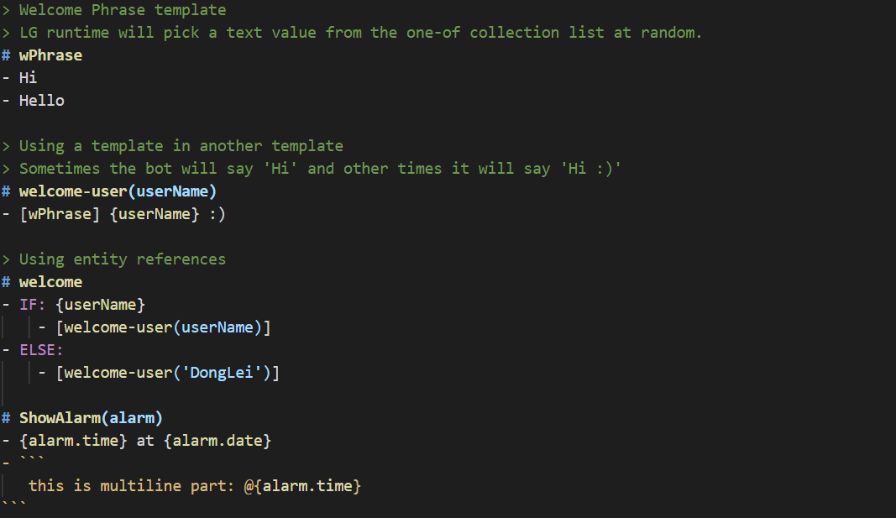
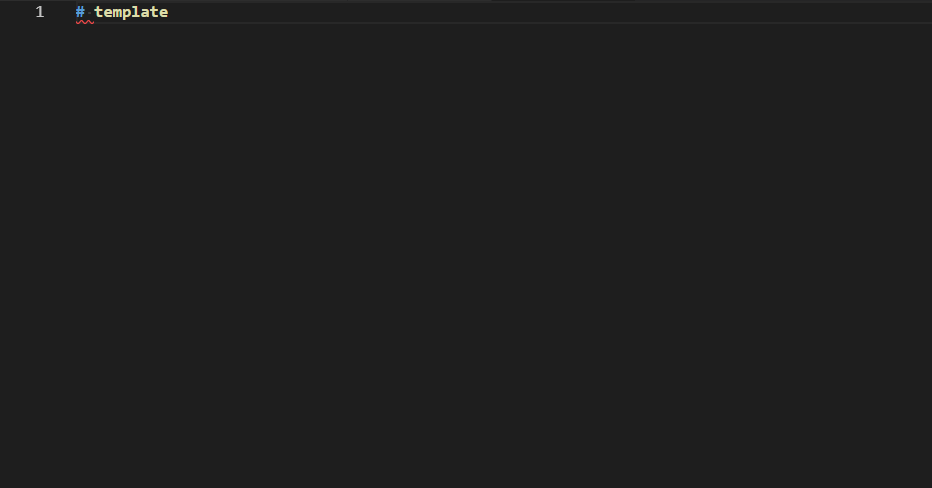
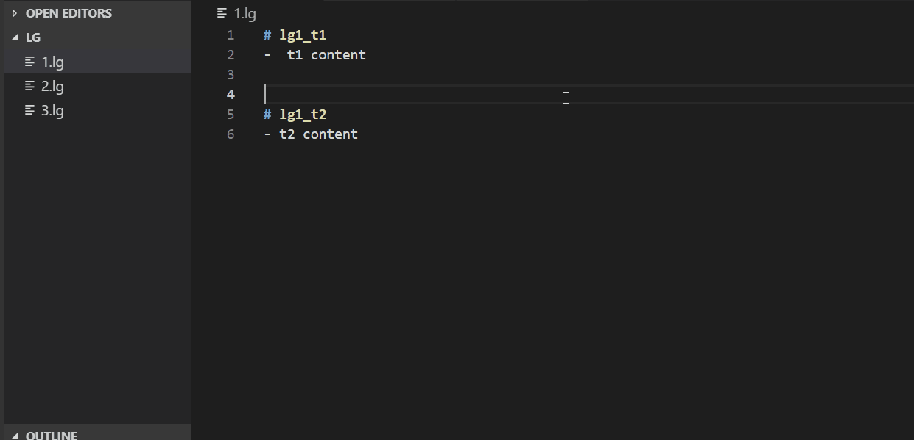
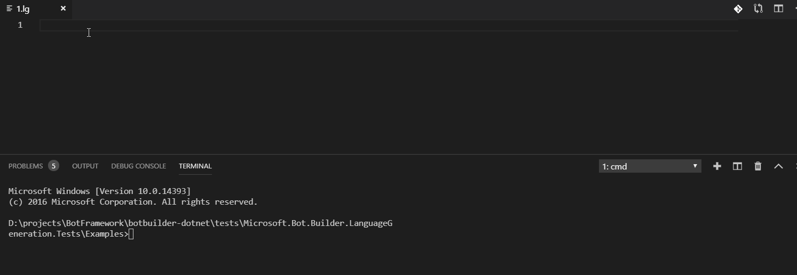
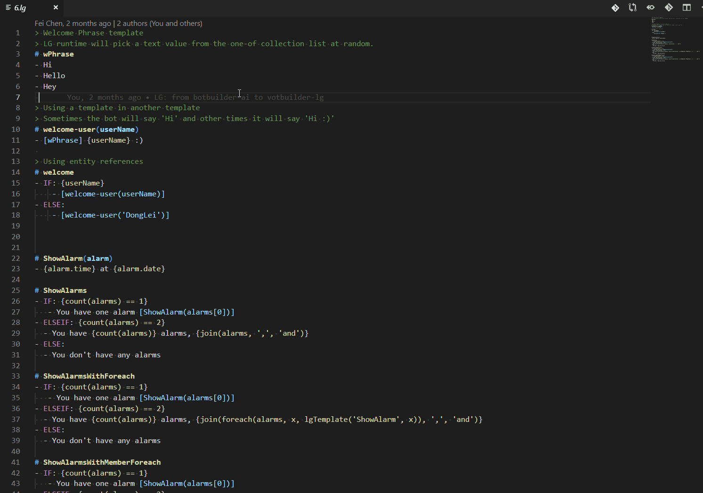

# lg-language README

lg language extension, provide:
- Syntax Highlight
- if/switch/template Snippet
- buildin functions Code Completion Proposals
- init webview show of lgfile
- diagnostic show

# how to use for customer
- use `vsce package` to export vsix file
- open vscode, and extension tab
- select 'install from VSIX...'
- select vsix file, and reopen vscode
- edit a lg file, try some features.
- input `LG live test` in `F1` space, try lgfile webview test (just framework now)

# features show
Highlight

Snippet

Code Completion

Show Definitions

Diagnostic

Live Test Tool
